<div align="center">

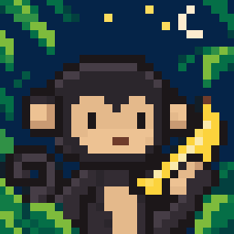

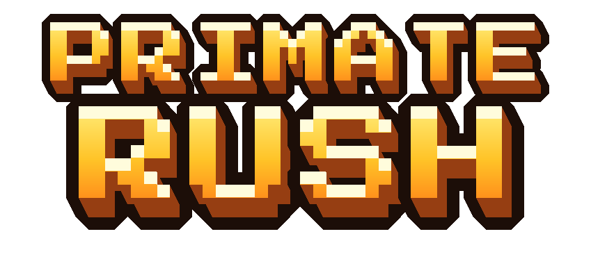

**Race. Swing. Slap.**
A pixel-art multiplayer party game for Android where chibi monkeys race, brawl and steal bananas.


[**Demo video**](#) · [**Download APK**](#) · [Features](#features) · [Monetization](#monetization-with-revenuecat) · [Build it](#build-it-yourself)

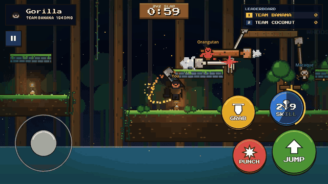

</div>

---

## About

Primate Rush is a short-round party game for up to four players. Pick a monkey, then race through the jungle, fight over bananas, or slap the other team off an island. **Nobody dies:** hits cost you time, position and bananas, never a life, so everyone plays the whole round and skill comes from movement and recovery.

Built in **Godot 4.7** (GDScript only) for Android, with purchases powered by the **RevenueCat SDK**. Made for the RevenueCat Shipaton 2026 (Next Gen Award).

## Features

<table>
<tr>
<td width="33%">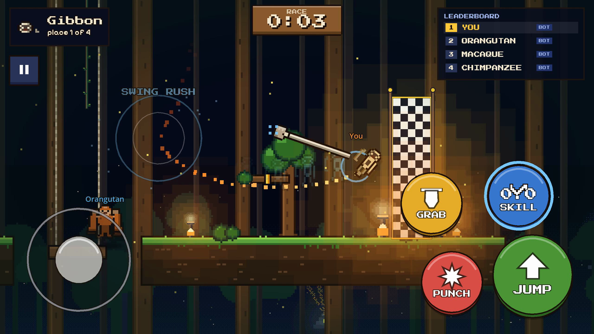<br/><b>Race</b><br/>Parkour to the finish line through Jungle Run or Canopy Climb.</td>
<td width="33%">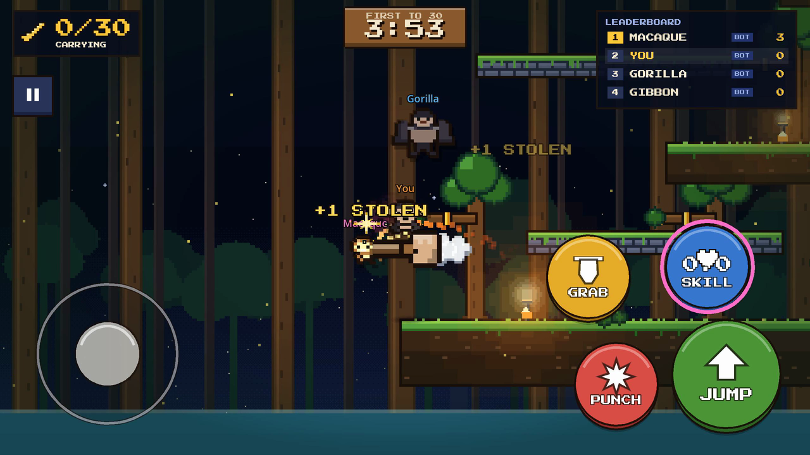<br/><b>Banana Rush</b><br/>Grab bananas and steal them on hit. First to 30 wins.</td>
<td width="33%">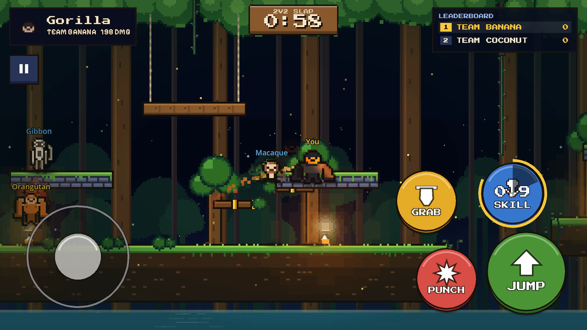<br/><b>2v2 Slap</b><br/>Knock the other team off Slap Island. Last team standing takes the round.</td>
</tr>
<tr>
<td>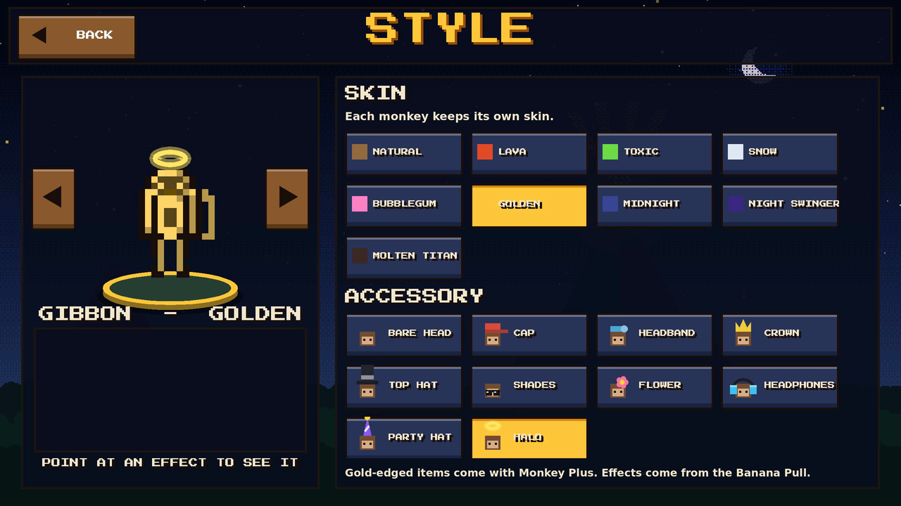<br/><b>Customization</b><br/>Skins, hats, trails, punch, climb and win effects.</td>
<td>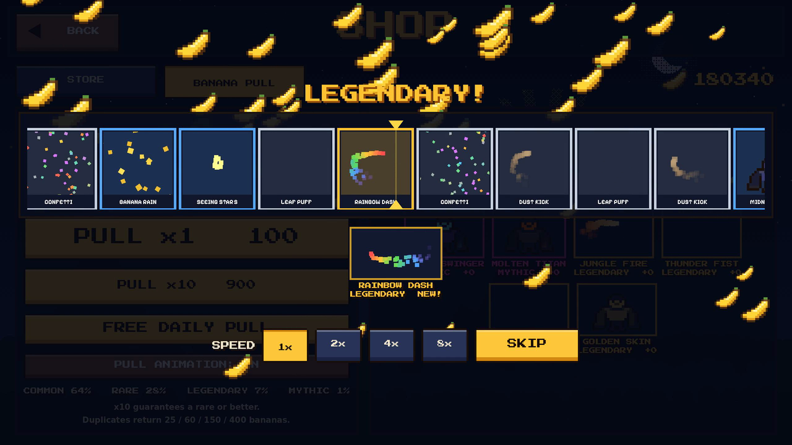<br/><b>Banana Pull</b><br/>Spend bananas on lucky rolls for rare and mythic cosmetics.</td>
<td>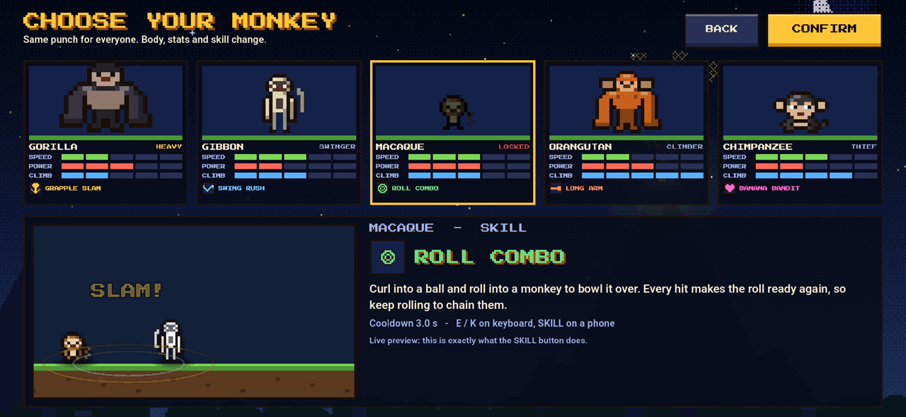<br/><b>Five monkeys</b><br/>Same punch for everyone; body, stats and skill change.</td>
</tr>
</table>

- **Swing, climb and fly:** stretchy-arm grabs, vine swinging with momentum, wall jumps and double jumps
- **Multiplayer:** local Wi-Fi play with host discovery, or fill empty seats with bots
- **Ranked:** climb from Bronze to Apex, plus local career stats
- **Touch-first controls:** stick plus four buttons, with full keyboard support on desktop

### The monkeys

| | Monkey | Role | Skill |
|:-:|---|---|---|
| 🦍 | **Gorilla** | Heavy brawler | **Grapple Slam**: lunge, lift a monkey overhead and slam it |
| 🦧 | **Orangutan** | Long range | **Long Arm**: a giant punch across the screen |
| 🐒 | **Macaque** *(Monkey Plus)* | Combo roller | **Roll Combo**: bowl monkeys over; every hit recharges it |
| 🐵 | **Gibbon** | Air speedster | **Swing Rush**: swing from thin air, untouchable mid-swing |
| 🍌 | **Chimpanzee** | Trickster | **Banana Bandit**: dash, steal a banana, drop a slippery peel |

## Monetization with RevenueCat

All purchases run through the **RevenueCat Android SDK** (via the GodotX RevenueCat plugin). Entitlements are the source of truth, and consumables add to the in-game banana wallet.

| Product | Type | Grants |
|---|---|---|
| `monkey_plus_v2` | Non-consumable → entitlement `monkey_plus` | Macaque, gold-edged skins and hats, premium effects |
| `starter_pack_v2` | Non-consumable → entitlement `starter_pack` | Midnight skin and Leaf Swirl trail |
| `bananas_small_v2` / `medium_v2` / `large_v3` | Consumable | 300 / 1,100 / 3,000 bananas |

<table>
<tr>
<td width="50%">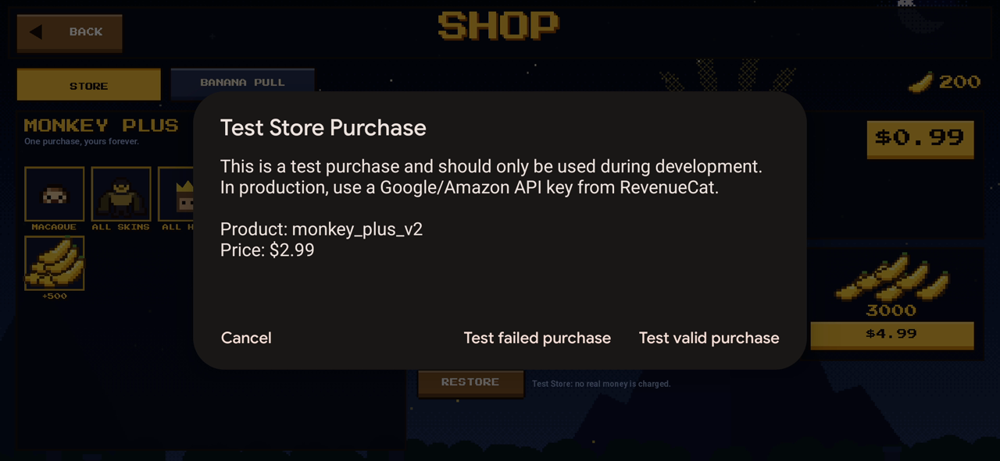<br/>Purchase sheet on device</td>
<td width="50%">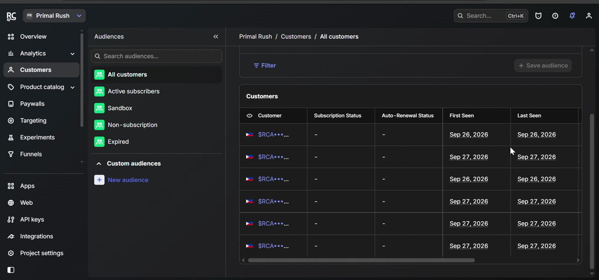<br/>Customers in the RevenueCat dashboard</td>
</tr>
</table>

The build uses RevenueCat's **Test Store**, so purchases produce real customers, entitlements and dashboard data without a Play Console account. Store code is guarded, so desktop builds run in a stub mode that never touches the store.

## Controls

| Action | Touch | Keyboard / mouse |
|---|---|---|
| Move | Left stick | A / D |
| Jump (double jump) | JUMP | Space |
| Punch | PUNCH | Left click |
| Grab / swing | GRAB | Right click |
| Skill | SKILL | E |
| Drop / slide | Stick down | S |
| Pause | ⏸ | Esc |

## Build it yourself

**Requirements:** Godot **4.7.2** with export templates, JDK **17 or 21** (Gradle 8.11 cannot run on Java 25), Android SDK with Platform 36 and Build-Tools 36.1.0.

```bash
git clone https://github.com/KieruGIT/Monkey-Game.git
```

1. Open the folder in Godot 4.7 and press **F5** to play on desktop (store runs in stub mode).
2. For Android:
   1. **Editor Settings → Export → Android**: set the Java SDK and Android SDK paths.
   2. **Project → Install Android Build Template**.
   3. Copy `secrets.cfg.example` to `secrets.cfg` and paste your RevenueCat **Test Store** API key (`test_...`). This file is gitignored.
   4. **Project → Export → Android**: *Use Gradle Build* is on and *Revenue Cat → Enable* is ticked, then **Export Project**.
3. Install the APK on a phone. In the shop, buying shows the RevenueCat Test Store sheet.

To test purchases with your own RevenueCat project, create the products listed above and attach them to the `monkey_plus` and `starter_pack` entitlements.

## Project structure

```
scenes/            Boot, Menu, Main arena, Player, HUD, Results, maps/
scripts/autoload/  GameConfig, Net (LAN), Purchases (RevenueCat), Loot, Profile, Sfx
scripts/player/    Player movement and combat, BotBrain, skills and effects
scripts/world/     Race, Banana Rush and Slap directors, map pieces
scripts/ui/        Menus, shop, Banana Pull reel, touch controls
resources/monkeys/ One .tres per monkey: balancing without code changes
addons/            GodotX RevenueCat plugin
android/           RevenueCat Android libraries
docs/              Design document, art bible, build notes
```

<details>
<summary><b>Design notes</b></summary>

- **Input is a struct, not a device.** `Player.gd` consumes an `InputFrame` that keyboard, touch, bots and the network all produce, so local and online play share one code path.
- **Bots get no special access.** A `BotBrain` only emits input frames, so every movement fix helps bots and players at once.
- **The host is truth.** The host simulates every monkey; hits and knockback resolve there only.
- **Attack flavors are cosmetic.** Slap, punch and kick share range, knockback and cooldown.
- **Stats are data.** Balancing is editing a `.tres` in the inspector.

</details>

## Credits

- Game design and development: **KieruGIT**
- UI and sound assets: [Kenney](https://kenney.nl) (CC0)
- Fonts: *Press Start 2P* by CodeMan38 and *Pixelify Sans* by Stefie Justprince (SIL Open Font License 1.1)
- Monetization: [RevenueCat](https://www.revenuecat.com) · Engine: [Godot](https://godotengine.org)

## License

Released under the [MIT License](LICENSE).
